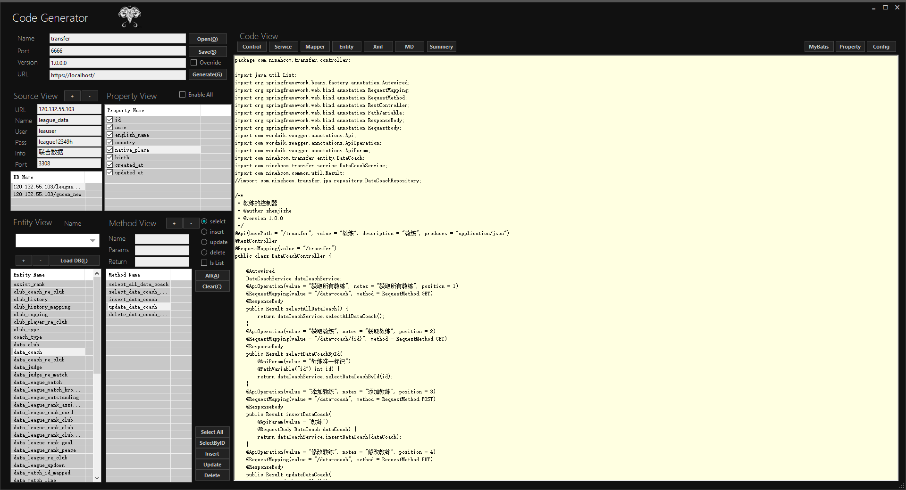
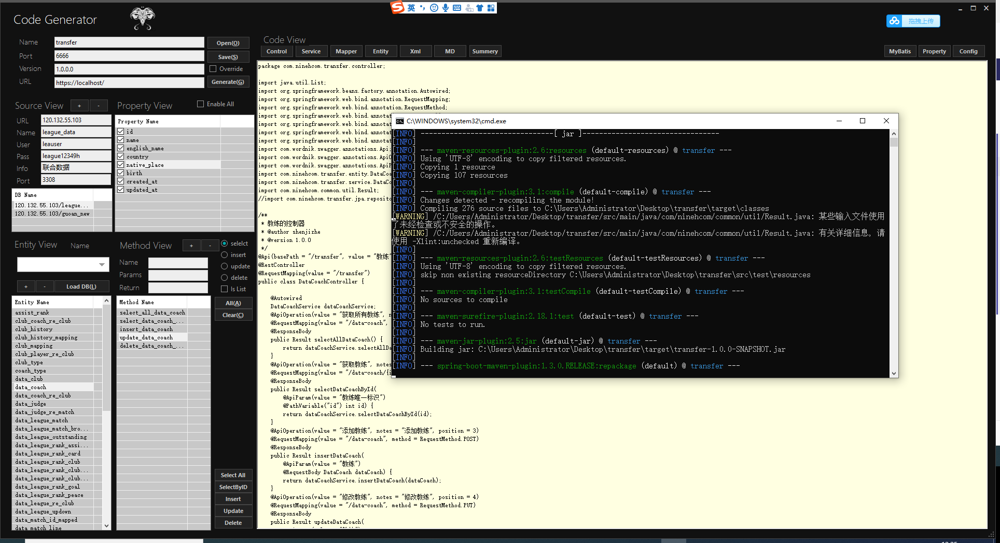
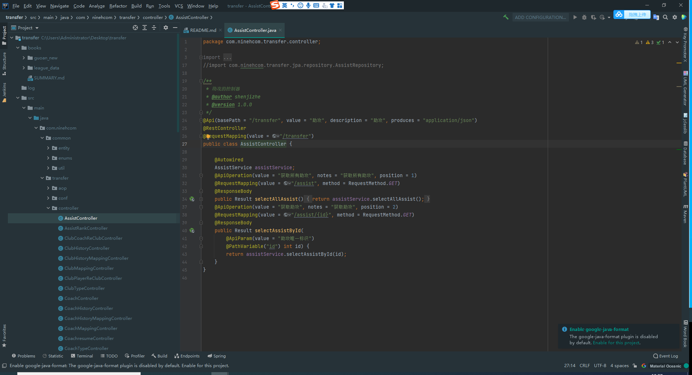

# SpringBootCodeGenerator
code generator for spring boot in c#

# 第一版代码生成器
```
只能生成固定的 spring boot 客户端工具
只有模型的概念，但没有模板的概念（本质上是固定模板）
后续开发了代码工厂项目 code factory,模型和模板生成任何语言的代码
```
## 操作主界面



## 生成代码


## 生成的工程
